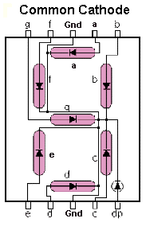

# Seven-Segment-with-Tang-Primer
Seven Segment Interface with Tang Primer

## Getting Started With Tang Primer:
- [Install The TD IDE](https://tang.sipeed.com/en/getting-started/)
- [Tang FPGA Examples](https://github.com/Lichee-Pi/Tang_FPGA_Examples)
- [Tang Primer GPIO and Project Info](https://tang.sipeed.com/en/using-tang/using-gpio/)

## File Structure: 
    ├── constraint
    │   └── io.adc
    ├── LICENSE
    ├── prj
    │   ├── Seven_Segment.al
    │   ├── Seven_Segment.bit
    │   ├── Seven_Segment_gate.area
    │   ├── Seven_Segment_gate.db
    │   ├── Seven_Segment_phy.area
    │   ├── Seven_Segment_pr.db
    │   ├── Seven_Segment_rtl.area
    │   ├── Seven_Segment_rtl.db
    │   ├── simulation
    │   ├── td_2021-01-03_17-04-28.log
    │   ├── td_2021-01-03_20-49-33.log
    │   └── td_2021-01-04_15-55-37.log
    ├── README.md
    └── src
        ├── a.out
        ├── Fibonacci_Series_TB.v    #Top Module
        ├── Fibonacci_Series.v       #Fibonacci Series generation module
        └── Seven_Segment.v          #Seven Segment Module

## Circuit:
- Common Cathode Pins Connected to FPGA via current limiting Resistor(330 ohm)
- IO used for testing - [IO INFO](https://github.com/ombhilare999/Seven-Segment-with-Tang-Primer/tree/main/constraint)

  

## Physical Summary:

  

## Fibonacci output on seven segment with tang primer:

  

